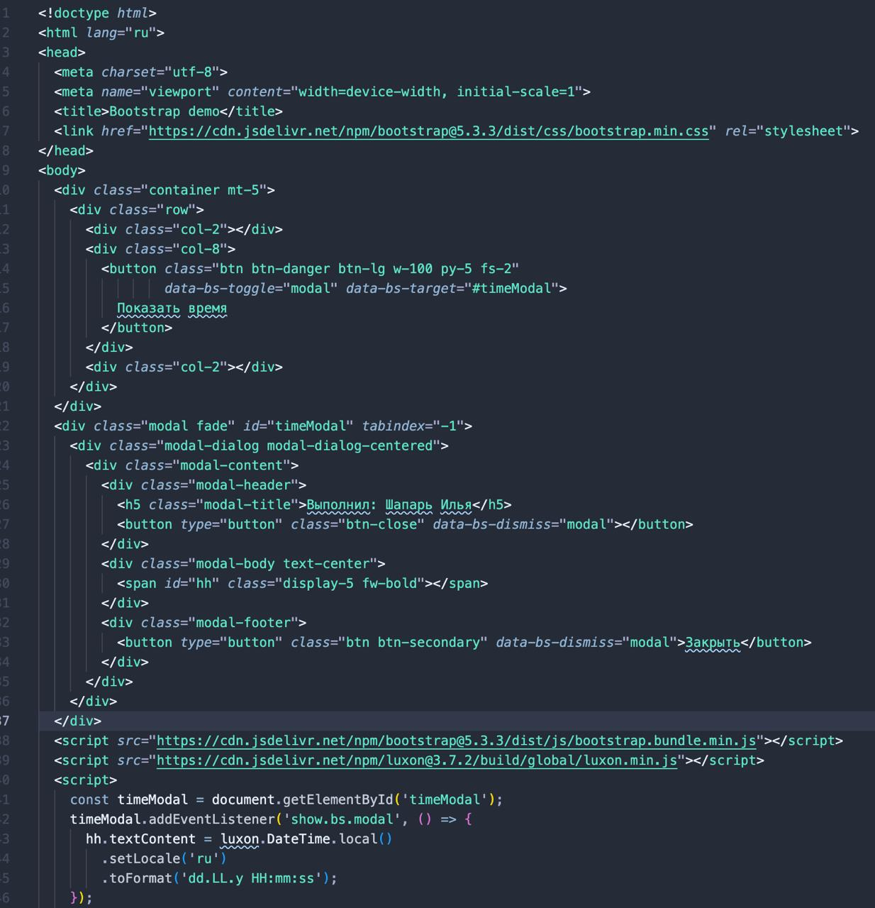
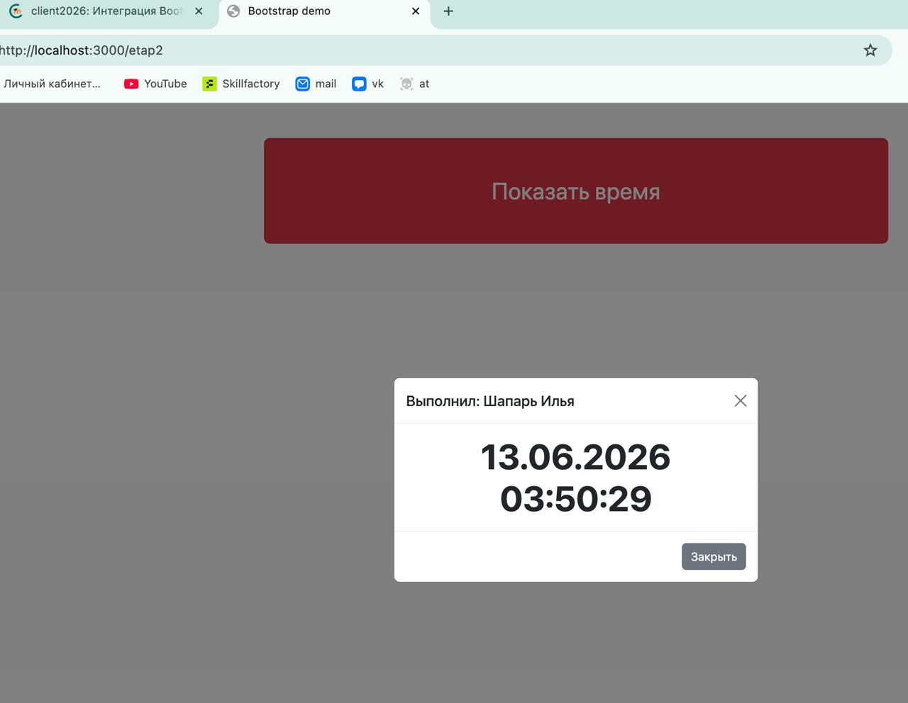

Приложение с **luxon** встроено в шаблон **Bootstrap 5**: страница из трёх колонок (2-8-2), в средней — большая красная кнопка «Показать время», по нажатию открывается модальное окно с именем выполнившего и текущими датой и временем (luxon). Окно закрывается крестиком и кнопкой «Закрыть».

## Последовательность выполненных действий

1. В шаблон Bootstrap 5 добавлена сетка из трёх колонок `col-2 / col-8 / col-2`.
2. В среднюю колонку помещена красная кнопка во всю ширину (`btn btn-danger btn-lg w-100`) с текстом «Показать время».
3. Добавлено модальное окно Bootstrap: в заголовке — имя и фамилия, в теле — дата и время, в подвале — кнопка «Закрыть»; крестик закрытия — в заголовке.
4. Кнопка открывает окно через атрибуты `data-bs-toggle="modal"` и `data-bs-target`.
5. При открытии окна (событие `show.bs.modal`) в его тело подставляется текущее время, построенное библиотекой luxon, в формате `dd.LL.y HH:mm:ss`.

## Скриншот кода (HTML целиком)



## Внешний вид приложения с раскрытым окном



## Полный код `index.html`

```html
<!doctype html>
<html lang="ru">
<head>
  <meta charset="utf-8">
  <meta name="viewport" content="width=device-width, initial-scale=1">
  <title>Bootstrap demo</title>
  <link href="https://cdn.jsdelivr.net/npm/bootstrap@5.3.3/dist/css/bootstrap.min.css" rel="stylesheet">
</head>
<body>
  <div class="container mt-5">
    <div class="row">
      <div class="col-2"></div>
      <div class="col-8">
        <button class="btn btn-danger btn-lg w-100 py-5 fs-2"
                data-bs-toggle="modal" data-bs-target="#timeModal">
          Показать время
        </button>
      </div>
      <div class="col-2"></div>
    </div>
  </div>

  <div class="modal fade" id="timeModal" tabindex="-1">
    <div class="modal-dialog modal-dialog-centered">
      <div class="modal-content">
        <div class="modal-header">
          <h5 class="modal-title">Выполнил: Шапарь Илья</h5>
          <button type="button" class="btn-close" data-bs-dismiss="modal"></button>
        </div>
        <div class="modal-body text-center">
          <span id="hh" class="display-5 fw-bold"></span>
        </div>
        <div class="modal-footer">
          <button type="button" class="btn btn-secondary" data-bs-dismiss="modal">Закрыть</button>
        </div>
      </div>
    </div>
  </div>

  <script src="https://cdn.jsdelivr.net/npm/bootstrap@5.3.3/dist/js/bootstrap.bundle.min.js"></script>
  <script src="https://cdn.jsdelivr.net/npm/luxon@3.7.2/build/global/luxon.min.js"></script>
  <script>
    const timeModal = document.getElementById('timeModal');
    timeModal.addEventListener('show.bs.modal', () => {
      hh.textContent = luxon.DateTime.local()
        .setLocale('ru')
        .toFormat('dd.LL.y HH:mm:ss');
    });
  </script>
</body>
</html>
```
