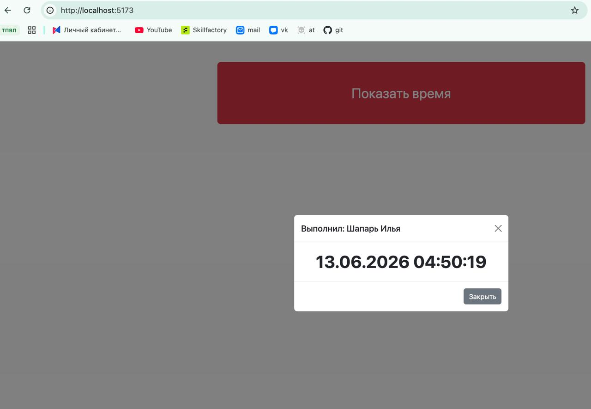

Приложение из Этапа 2 (3 колонки 2-8-2, красная кнопка «Показать время», модальное окно с датой и временем от **luxon**) пересобрано на хосте сборщиком **Vite**. Bootstrap и luxon установлены как npm-зависимости (без CDN), импортируются только используемые компоненты и утилиты — чтобы бандл был минимальным.

## Ссылки

- Репозиторий с исходниками: **https://github.com/fkea1da/vite-luxon**
- Опубликованное приложение: **https://fkea1da.github.io/portfolio/etap3/**

## Последовательность выполненных действий

1. Создан новый проект, установлены зависимости:
   ```bash
   npm i bootstrap luxon
   npm i -D vite sass
   ```
2. Создан `index.html` с разметкой Bootstrap (колонки `col-2 / col-8 / col-2`, красная кнопка, модальное окно).
3. В `src/scss/styles.scss` импортированы **только нужные** части Bootstrap (containers, grid, buttons, modal, close) и оставлены **только используемые утилиты** — для уменьшения CSS.
4. В `src/js/main.js` импортированы только модуль `bootstrap/js/dist/modal` и luxon; при клике по кнопке в окно подставляется текущее время.
5. Проект собран командой `npm run build`, собранная папка `dist/` опубликована на статическом сайте.

## Команда сборки и package.json

Проект собирается командой:

```bash
npm run build
```

Соответствующие строки в `package.json`:

```json
"scripts": {
  "dev": "vite",
  "build": "vite build",
  "preview": "vite preview"
}
```

## Размер полученного бандла

| Файл | Размер | Gzip |
|---|---|---|
| `index.html` | 1.30 КБ | 0.60 КБ |
| `assets/index-*.css` | 43.82 КБ | 8.25 КБ |
| `assets/index-*.js` | 93.95 КБ | 29.39 КБ |

Основной вес JS — сама библиотека luxon; Bootstrap ужат за счёт импорта только используемых компонентов и утилит (для сравнения: при импорте всего Bootstrap CSS был бы ~115 КБ вместо 44 КБ).

## Внешний вид приложения (UI)


