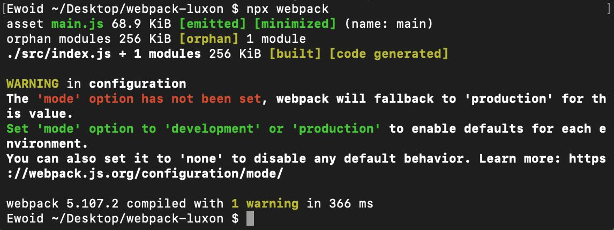
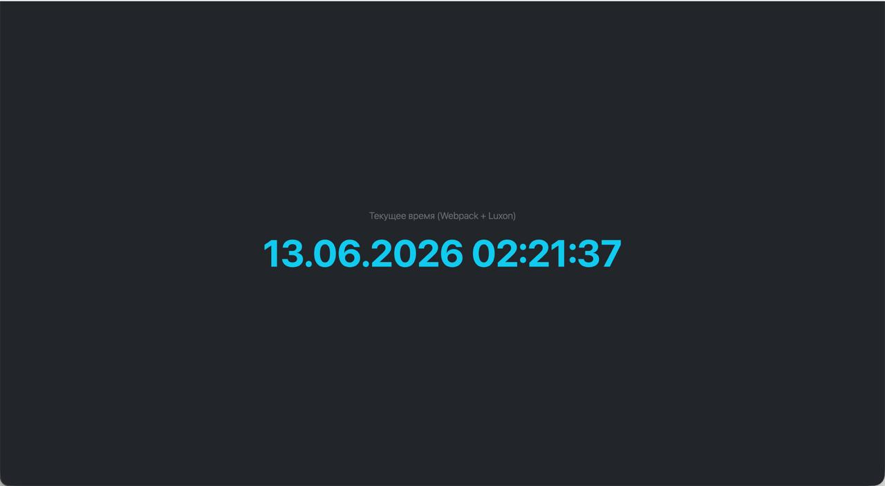
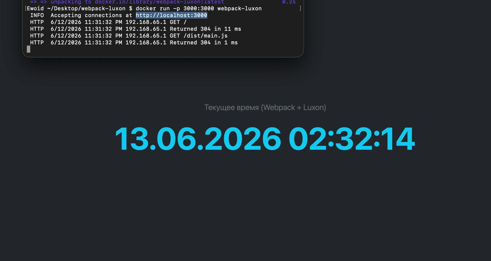

Проект собран сборщиком **Webpack**: библиотека **Luxon** выводит текущее время, оформление — **Bootstrap (CDN)**. Та же сборка повторена внутри **Docker** на образе `node:24-alpine`.

## Скриншот с результатами сборки команды `npx webpack`



## Bootstrap в режиме CDN — внешний вид страницы (вывод Luxon крупно)



## Содержимое Dockerfile

```dockerfile
FROM node:24-alpine
WORKDIR /app
COPY package*.json ./
RUN npm install
COPY . .
RUN npx webpack
EXPOSE 3000
CMD ["npx", "serve", ".", "-l", "3000"]
```

## Запуск приложения с помощью Docker

Последовательность действий для запуска:

```bash
# собрать образ (внутри прогоняется npx webpack)
docker build -t webpack-luxon .

# запустить контейнер с пробросом порта 3000
docker run -p 3000:3000 webpack-luxon
```

Приложение доступно на `http://localhost:3000` — страницу отдаёт контейнер:


